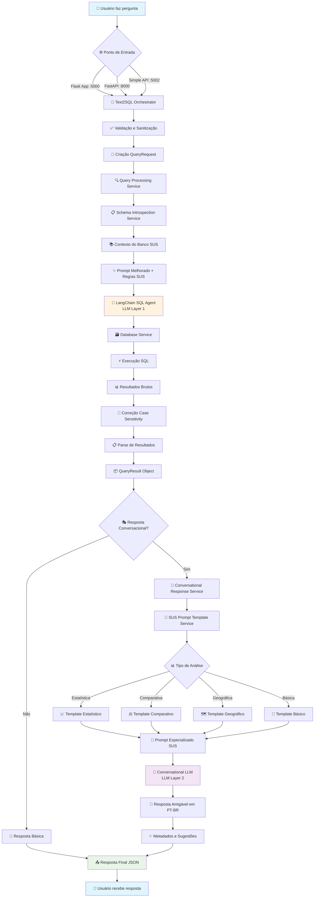
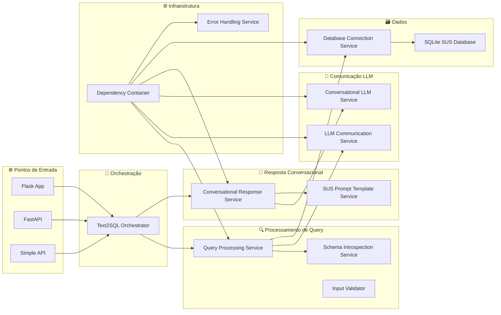
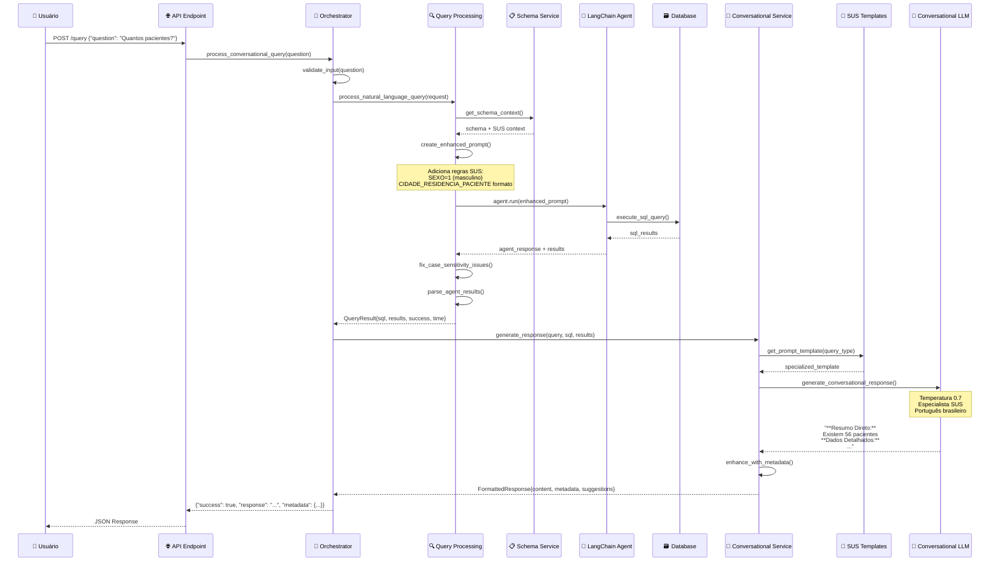
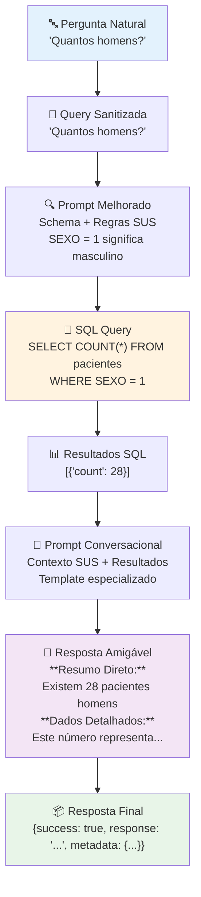
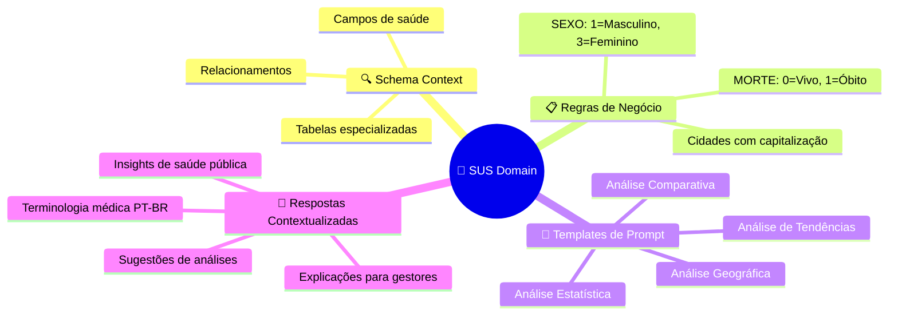

# 🔄 Fluxo Completo do Projeto TXT2SQL

Este documento descreve o fluxo completo de processamento desde quando uma pergunta do usuário entra no sistema até a resposta conversacional final.

## 📊 Diagrama de Fluxo Principal



## 🏗️ Arquitetura de Serviços



## 🔄 Fluxo Detalhado de Processamento



## 📋 Transformações de Dados



## 🏥 Especialização para Domínio SUS



## ⚡ Principais Componentes

### 🎯 **Text2SQLOrchestrator**
- **Função**: Coordenador central do fluxo
- **Responsabilidades**: Validação, orquestração de serviços, formatação de resposta
- **Método Principal**: `process_conversational_query()`

### 🔍 **QueryProcessingService** 
- **Função**: Conversão de linguagem natural para SQL
- **Tecnologia**: LangChain SQL Agent + Ollama
- **Especialização**: Regras específicas para dados SUS brasileiros

### 💬 **ConversationalResponseService**
- **Função**: Geração de respostas amigáveis
- **Características**: Memória de contexto, sugestões inteligentes
- **Integração**: SUS Prompt Templates + Conversational LLM

### 🏥 **SUSPromptTemplateService**
- **Função**: Templates especializados para análises de saúde
- **Tipos**: Estatística, Comparativa, Geográfica, Tendências
- **Base de Conhecimento**: Terminologia SUS, indicadores de saúde

### 🗃️ **DatabaseConnectionService**
- **Função**: Gerenciamento de conexões SQLite
- **Dupla Interface**: LangChain SQLDatabase + conexão raw
- **Dados**: Base SUS com informações de pacientes

## 🎯 Resultado Final

O sistema produz respostas conversacionais estruturadas em português brasileiro:

```json
{
  "success": true,
  "question": "Quantos pacientes são homens?",
  "response": "**Resumo Direto:**\nExistem 28 pacientes do sexo masculino cadastrados.\n\n**Dados Detalhados:**\nEste número representa uma parcela significativa dos pacientes atendidos pelo SUS, fornecendo informações importantes para o planejamento de políticas de saúde específicas para a população masculina.",
  "execution_time": 12.34,
  "metadata": {
    "conversational_response": true,
    "response_type": "statistical_analysis",
    "confidence_score": 0.9,
    "suggestions": [
      "Gostaria de ver a distribuição por faixa etária?",
      "Posso comparar com dados de outras regiões",
      "Quer analisar tendências temporais destes dados?"
    ]
  },
  "timestamp": "2025-06-20T11:30:00.000Z"
}
```

## 🚀 Benefícios da Arquitetura

- **🔧 Modularidade**: Cada serviço tem responsabilidade única
- **🧪 Testabilidade**: Componentes podem ser testados isoladamente  
- **⚙️ Configurabilidade**: Diferentes implementações via factories
- **🌐 Escalabilidade**: Serviços podem ser distribuídos
- **🏥 Especialização**: Otimizado para domínio SUS brasileiro
- **💬 UX Amigável**: Respostas naturais em português brasileiro