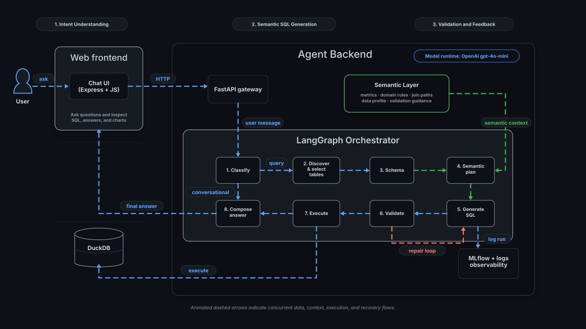
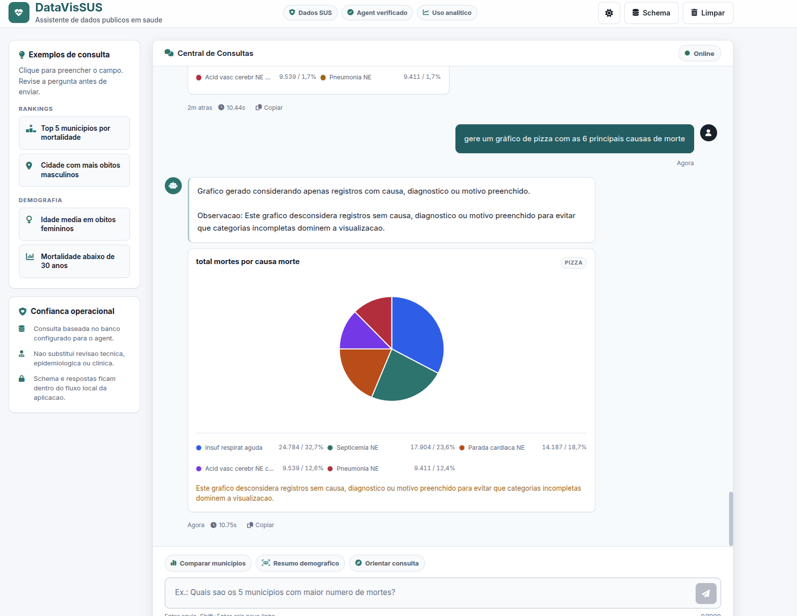
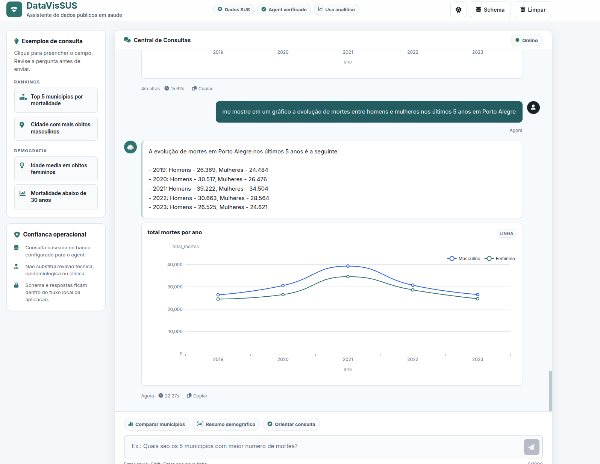

# DataVisSUS Text-to-SQL Agent

[](https://www.python.org/)
[](https://openai.com/)
[](https://github.com/langchain-ai/langgraph)
[](https://fastapi.tiangolo.com/)
[](https://docs.pydantic.dev/)
[](https://echarts.apache.org/)

DataVisSUS is a research-oriented Text-to-SQL agent for Brazilian public healthcare analytics. It translates natural-language questions into executable SQL, validates the query against semantic and database constraints, executes it, and returns a natural-language answer with optional chart output.

The project is designed as an AI Engineering and AI Research artifact: the focus is not only generating SQL, but studying semantic robustness, tool-grounded execution, structured LLM outputs, evaluation methodology, ablations, and failure modes in hard analytical questions.

## Contents

- [What This Project Is](#what-this-project-is)
- [Architecture](#architecture)
- [Agent Workflow](#agent-workflow)
- [AI Engineering Design](#ai-engineering-design)
- [Technology Stack](#technology-stack)
- [Project Structure](#project-structure)
- [Quick Start](#quick-start)
- [Usage](#usage)
- [Evaluation and Research](#evaluation-and-research)
- [Observability](#observability)
- [License](#license)

## What This Project Is

This repository implements a LangGraph-based agent that answers analytical questions over DATASUS-style health data. The core workload is semantically difficult Text-to-SQL: mortality counts and rates, temporal comparisons, top-N rankings, denominator-sensitive metrics, anti-conditions, business rules, and domain-specific table/column selection.

The system is intentionally built to improve generalization rather than overfit a benchmark. It separates:

- **Intent routing** from SQL generation.
- **Table discovery** from schema retrieval.
- **Semantic planning** from SQL synthesis.
- **SQL generation** from validation and execution.
- **Chart intent** from default text answers.
- **Evaluation** from component ablation.

Supported interfaces:

- Interactive CLI.
- FastAPI API.
- Node/Express web chat frontend.
- Evaluation runners for DAG evaluation, regression, ablation, table selection, and chart generation.

## Architecture



The animated diagram above shows the current default runtime path. In the default
`llamaindex_mode=context` mode, LlamaIndex is called during table selection to
retrieve table candidates and prompt-ready schema context. Later graph nodes
consume that selected table set and schema context.

The architecture is composed of:

- **Web frontend**: chat UI, optional SQL visibility, table rendering, and Apache ECharts rendering.
- **Agent Backend**: FastAPI plus the production LangGraph orchestrator.
- **LangGraph Orchestrator**: explicit state-machine workflow for routing, planning, SQL generation, validation, execution, repair, and response synthesis.
- **LlamaIndex schema retrieval**: vector retrieval over generated schema/catalog documents to select runtime tables and provide prompt-ready schema context.
- **Semantic Layer**: reusable domain catalog, data profile, metric rules, join paths, macros, and SQL contract checks.
- **SQL tools and database runtime**: SQLDatabaseToolkit tools for table inventory, optional schema verification, validation, and execution over the configured database.
- **Observability**: logs and optional MLflow tracking.

## Agent Workflow

The production graph is defined in [`src/agent/workflow.py`](src/agent/workflow.py). The main path is:

1. **Classify**
   - Determines whether the user message is `database`, `conversational`, `schema`, `clarification`, or `error`.
   - Database questions continue to table discovery.
   - Conversational questions go directly to response generation.

2. **Discover and Select Tables**
   - Implemented in [`src/agent/table_selection.py`](src/agent/table_selection.py).
   - Uses LlamaIndex schema retrieval by default (`llamaindex_mode=context`).
   - This is the only direct LlamaIndex call in the default single-query path.
   - Schema-error repair and multi-query subqueries may re-run table selection with a narrower prompt.
   - The old LangGraph heuristic/embedding/LLM table-selection cascade is no longer used by the runtime agent.

3. **Schema Context**
   - Implemented in [`src/agent/schema_node.py`](src/agent/schema_node.py).
   - Uses the LlamaIndex schema/domain context produced by table selection as the default prompt schema source.
   - Does not call LlamaIndex again in the default path; it only reads the context already stored in graph state.
   - `sql_db_schema` is now an optional live verification/debug path, enabled with `--verify-llamaindex-schema-with-db` or `VERIFY_LLAMAINDEX_SCHEMA_WITH_DB=true`.

4. **Plan Gate and Semantic Plan**
   - `plan_gate` builds the first semantic contract, stores assumptions/invariants, and routes clarification or schema-unavailable cases before SQL generation.
   - [`src/semantic/plan_schema.py`](src/semantic/plan_schema.py) defines the Pydantic `SemanticPlan` contract.
   - [`src/agent/semantic_planner.py`](src/agent/semantic_planner.py) reconciles heuristic and structured LLM semantic plans.
   - Multi-query planning is opt-in for experiments/ablation; the default chatbot path is single-query.

5. **SQL Strategy and Generation**
   - [`src/agent/sql_strategy.py`](src/agent/sql_strategy.py) selects a deterministic compiler when the semantic plan is supported.
   - [`src/agent/sql_compilers/`](src/agent/sql_compilers/) defines the SQL compiler boundary.
   - [`src/agent/sql_generation.py`](src/agent/sql_generation.py) still owns orchestration, but deterministic SQL, fallback prompt construction, and strategy routing are separated.
   - LLM SQL generation is the fallback path, not the default for shapes already covered by deterministic compilers.
   - `reasoning_node` is an opt-in diagnostic/ablation node and is disabled in the default runtime path.

6. **Validation**
   - [`src/agent/validation.py`](src/agent/validation.py) validates SQL using SQLDatabaseToolkit query checking plus semantic and contract validators.
   - Validation targets common semantic failures: wrong denominators, wrong output shape, invalid top-N grouping, wrong filters, and unsafe SQL.
   - Semantic validation returns structured findings with severity. Blocking invariants live in [`src/semantic/invariant_validator.py`](src/semantic/invariant_validator.py).

7. **Execution**
   - [`src/agent/execution.py`](src/agent/execution.py) executes validated SQL through `sql_db_query`.
   - Non-`SELECT` SQL is blocked by safety checks.

8. **Repair Loop**
   - If validation or execution fails, repair can route back to SQL generation or validation.
   - Semantic repair guidance is stored in [`src/semantic/repair_guidance.yml`](src/semantic/repair_guidance.yml).
   - Repair is intentionally narrow: syntax, binder, missing table/column, and similar repairable SQL failures can retry; semantic invariant failures are blocked instead of repeatedly rewritten.

9. **Compose Answer**
   - [`src/agent/answer_contract.py`](src/agent/answer_contract.py) records the executed SQL, rows, answer type, assumptions, warnings, and formatted numeric fields.
   - [`src/agent/response_renderers/`](src/agent/response_renderers/) formats common result shapes deterministically without an extra LLM call.
   - If the user explicitly requested a chart, the response may also include a structured chart payload.

Default simplification summary:

- `intent_planning` is not part of the runtime graph.
- `query_planner` and multi-query execution remain available for experiments but are not on the default path.
- CoT-style `reasoning_node` is disabled by default.
- Schema knowledge is centralized in SchemaCards and the semantic catalog instead of long duplicated prompt snippets.
- Validation is a guardrail over explicit invariants, not a second planner.

## AI Engineering Design

### Pydantic Structured Outputs

Pydantic is used as a typed contract layer between LLM reasoning and deterministic code. This reduces ambiguous parsing and makes downstream validation explicit.

Important contracts:

| Contract | File | Purpose |
|---|---|---|
| `SemanticPlan` | [`src/semantic/plan_schema.py`](src/semantic/plan_schema.py) | Semantic intent, metrics, dimensions, filters, answer shape, constraints |
| `SemanticPlannerOutput` | [`src/agent/semantic_planner.py`](src/agent/semantic_planner.py) | LLM-reconciled semantic plan with confidence and reasoning |
| `SQLOutput` | [`src/agent/sql_generation.py`](src/agent/sql_generation.py) | Structured SQL generation result |
| `VisualizationIntent`, `ChartPlan`, `ChartSpec` | [`src/visualization/schema.py`](src/visualization/schema.py) | Explicit chart generation contracts |
| API request/response models | [`src/interfaces/api/main.py`](src/interfaces/api/main.py) | FastAPI data contracts |

The central structured-output adapter is:

```python
structured_llm = self._llm.with_structured_output(output_schema)
```

in [`src/agent/llm_manager.py`](src/agent/llm_manager.py).

### Tool Calling and Tool-Grounded Execution

The agent uses LangChain `SQLDatabaseToolkit` tools and binds them to the OpenAI model through `bind_tools`. The workflow also invokes tools directly inside deterministic graph nodes, which keeps the critical path inspectable.

Tools used in the pipeline:

| Tool | Main Step | Purpose |
|---|---|---|
| `sql_db_list_tables` / enhanced list tool | Discover tables | Database table inventory with curated descriptions; LlamaIndex performs semantic selection over this inventory |
| `sql_db_schema` | Schema context | Optional live schema verification for LlamaIndex-selected tables |
| `sql_db_query_checker` | Validate | LLM-assisted SQL query checking |
| `sql_db_query` | Execute | Query execution against the configured database |

LlamaIndex is not exposed as a SQLDatabaseToolkit tool. It is invoked by
[`src/agent/table_selection.py`](src/agent/table_selection.py) through
[`src/agent/llamaindex_context.py`](src/agent/llamaindex_context.py), using the
generated schema catalog under [`src/application/schema/generated/`](src/application/schema/generated/).

The tool setup is implemented in [`src/agent/llm_manager.py`](src/agent/llm_manager.py). Tool execution records are persisted in the graph state through `ToolCallResult`, making tool usage observable and evaluable.

### Semantic Layer

The semantic layer is the main generalization mechanism. It is not intended to memorize benchmark questions. It encodes reusable domain abstractions:

- Metrics and denominator rules.
- Domain filters and code mappings.
- Join paths.
- SQL macro expectations.
- Data profiles.
- Answer-shape constraints.
- Semantic repair guidance.
- AST-level SQL contract checks.

Key files:

- [`src/application/schema/schema_cards.py`](src/application/schema/schema_cards.py)
- [`src/application/schema/schema_context_renderer.py`](src/application/schema/schema_context_renderer.py)
- [`src/semantic/catalog.yml`](src/semantic/catalog.yml)
- [`src/semantic/catalog.py`](src/semantic/catalog.py)
- [`src/semantic/planner.py`](src/semantic/planner.py)
- [`src/semantic/resolvers/`](src/semantic/resolvers/)
- [`src/semantic/plan_reconciler.py`](src/semantic/plan_reconciler.py)
- [`src/semantic/contract_validator.py`](src/semantic/contract_validator.py)
- [`src/semantic/invariant_validator.py`](src/semantic/invariant_validator.py)
- [`src/semantic/sql_ast.py`](src/semantic/sql_ast.py)
- [`src/semantic/profiles/generated_profile.json`](src/semantic/profiles/generated_profile.json)

When adding a new database metric, start with `src/semantic/catalog.yml`, then add resolver/planner behavior only if the catalog contract is not enough. SQL generation should prefer adding or extending a compiler in `src/agent/sql_compilers/` over adding another prompt-only rule.

### Explicit Chart Generation

Charts are opt-in. The agent should only generate a chart when the user explicitly asks for one.

The design goal is to keep charting deterministic after intent extraction: the LLM identifies the visualization intent and fills structured chart contracts, while the backend/frontend convert the validated `ChartSpec` into Apache ECharts options.

The chart pipeline is:

1. Detect visualization intent.
2. Build a structured `ChartPlan`.
3. Generate SQL shaped for the visual contract.
4. Validate chart compatibility.
5. Return `ChartSpec`.
6. Convert `ChartSpec` to Apache ECharts options for the frontend.

Relevant files:

- [`src/visualization/intent.py`](src/visualization/intent.py)
- [`src/visualization/planner.py`](src/visualization/planner.py)
- [`src/visualization/schema.py`](src/visualization/schema.py)
- [`src/visualization/echarts.py`](src/visualization/echarts.py)
- [`frontend/public/app.js`](frontend/public/app.js)

### Chart Examples in the UI

Example prompt:

```text
gere um gráfico de pizza com as 6 principais causas de morte
```

The agent generates a validated SQL query, returns an answer explaining the filtering assumptions, and sends a structured chart payload to the frontend. The UI renders the result with Apache ECharts, including category colors, labels, legend values, and chart-type metadata.



Example prompt:

```text
me mostre em um gráfico a evolução de mortes entre homens e mulheres nos últimos 5 anos em Porto Alegre
```

Temporal chart requests are handled as structured time-series outputs. The generated chart preserves the requested temporal dimension on the x-axis, separates each series by category, and keeps the natural-language answer aligned with the rendered data.



## Technology Stack

Version constraints are defined in [`pyproject.toml`](pyproject.toml) and [`frontend/package.json`](frontend/package.json).

| Layer | Technology | Version / Constraint | Role |
|---|---|---:|---|
| Language | Python | `>=3.11` | Backend, agent, evaluation |
| Model provider | OpenAI | SDK `>=1.55.0` | LLM runtime |
| Default model | `gpt-4o-mini` | Config default | SQL, semantic planning, response synthesis |
| Orchestration | LangGraph | `>=1.1.10` | Explicit graph workflow |
| Schema retrieval | LlamaIndex Core + OpenAI integrations | Core `>=0.12.0`; LLM/embeddings `>=0.3.0` | Schema-context retrieval and optional SQL draft |
| LLM/tool framework | LangChain Core | `>=0.3.74` | Messages, tools, structured calls |
| SQL tools | LangChain Community | `>=0.3.25` | SQLDatabaseToolkit |
| OpenAI integration | LangChain OpenAI | `>=0.3.32` | Chat model and structured output |
| API | FastAPI | `>=0.115.13` | REST API |
| ASGI runtime | Uvicorn | `>=0.34.3` | API serving |
| Data contracts | Pydantic | `>=2.11.7` | API models, semantic plans, chart specs |
| Experiment tracking | MLflow | `>=2.15.0` | Optional run and ablation tracking |
| Database access | SQLAlchemy | `2.0.41` | DB engine abstraction |
| Primary analytical DB | DuckDB | `1.4.4` | Main local database runtime |
| DuckDB SQLAlchemy | duckdb-engine | `0.17.0` | DuckDB URL support |
| Embeddings | sentence-transformers | `>=2.6.1` | Local memory/vector-store support |
| Frontend runtime | Node.js | `>=16` | Web interface server |
| Web server | Express | `^4.18.2` | Frontend proxy/server |
| Charts | Apache ECharts | `5.6.0` via CDN | SVG chart rendering in UI |
| Quality | Ruff | `>=0.11.0` | Lint and formatting |
| Tests | pytest | `>=8.4.2` | Unit and regression tests |

## Project Structure

```bash
txt2sql_refactor_openai_v2/
├── src/
│   ├── agent/
│   │   ├── workflow.py              # LangGraph state graph
│   │   ├── orchestrator.py          # Production orchestrator and session handling
│   │   ├── classification.py        # Query routing
│   │   ├── table_selection.py       # Runtime table selection via LlamaIndex retrieval
│   │   ├── llamaindex_context.py    # Schema-document indexing and retrieval
│   │   ├── llamaindex_sql_generator.py # Optional SQL-draft path
│   │   ├── schema_node.py           # Schema context loading and optional DB verification
│   │   ├── semantic_planner.py      # Structured semantic plan reconciliation
│   │   ├── sql_generation.py        # Reasoning and structured SQL output
│   │   ├── validation.py            # SQL and semantic validation
│   │   ├── execution.py             # Tool-grounded SQL execution
│   │   ├── query_planner.py         # Single vs multi-query planning
│   │   ├── multi_executor.py        # Multi-query execution path
│   │   ├── result_synthesizer.py    # Multi-result answer synthesis
│   │   └── tools/                   # Custom LangChain tools
│   ├── application/
│   │   ├── config/                  # Runtime config and table metadata
│   │   ├── prompts/                 # Versioned prompt catalogs
│   │   └── schema/generated/        # Generated schema catalog consumed by LlamaIndex
│   ├── interfaces/
│   │   ├── api/main.py              # FastAPI app
│   │   └── cli/agent.py             # CLI interface
│   ├── semantic/                    # Semantic catalog, plans, validators, profiles
│   ├── visualization/               # Chart intent, planning, validation, ECharts adapter
│   └── utils/                       # Logging, SQL safety, helper utilities
├── evaluation/
│   ├── runners/                     # DAG, ablation, regression, chart, table-selection runners
│   ├── dag/                         # Evaluation DAG tasks
│   ├── metrics/                     # EX, CM, EM and SQL comparison metrics
│   ├── ablation/results/            # Ablation outputs
│   ├── table_selection/             # Table-selection benchmark
│   └── visualization/               # Chart evaluation artifacts
├── frontend/                        # Node/Express + vanilla JS web UI
├── assets/animated/                 # README animated architecture diagram variants
├── assets/screenshots/              # README UI examples
├── data/                            # SQLite checkpoint DB
├── logs/                            # Runtime logs
├── tests/                           # Unit tests
├── pyproject.toml
├── uv.lock
└── README.md
```

## Quick Start

### Prerequisites

- Python 3.11 or higher.
- Node.js 16 or higher for the web UI.
- OpenAI API key.
- DuckDB database file available through a DuckDB SQLAlchemy URL.

### 1. Clone the Repository

```bash
git clone <repository-url>
cd txt2sql_refactor_openai_v2
```

### 2. Install Python Requirements

Recommended path with `uv`:

```bash
python -m pip install uv
uv sync --extra dev
```

You do not need to activate the virtual environment when using `uv run`.

Fallback without `uv`:

```bash
python -m venv .venv
source .venv/bin/activate
pip install -r requirements.txt
```

### 3. Configure Environment

Create the environment file:

```bash
cp .env.example .env
```

Edit `.env` and set at least `OPENAI_API_KEY` plus `DATABASE_PATH`.

Typical variables:

```env
OPENAI_API_KEY=sk-your_openai_key_here

# Main database: local DuckDB file
DATABASE_PATH=duckdb:////absolute/path/to/sihrd5.duckdb?access_mode=read_only

# Optional alias if you prefer a SQLAlchemy URL variable
# DATABASE_URL=duckdb:////absolute/path/to/sihrd5.duckdb?access_mode=read_only

# Optional observability
MLFLOW_TRACKING_URI=sqlite:///mlflow.db
MLFLOW_EXPERIMENT=txt2sql-agent
```

The app resolves the database in this order:

1. `DATABASE_URL`
2. `DATABASE_PATH`

For the standard local setup, keep `DATABASE_URL` unset and use `DATABASE_PATH`
pointing to the DuckDB file.

### 4. Start API and Frontend

Start both services from the repository root with one command:

```bash
uv run python scripts/dev.py
```

The first run installs frontend dependencies if `frontend/node_modules` is
missing. The launcher also wires the web UI to the API with
`API_BASE_URL=http://localhost:8000/api/v1`.

Open:

- API: `http://localhost:8000`
- Swagger docs: `http://localhost:8000/docs`
- Frontend: `http://localhost:3000`

Useful options:

```bash
uv run python scripts/dev.py --reload-api
uv run python scripts/dev.py --api-port 8001 --frontend-port 3001
uv run python scripts/dev.py --skip-npm-install
```

Stop both services with `Ctrl+C`.

If you installed dependencies without `uv`, activate the virtual environment and run:

```bash
python scripts/dev.py
```

### 5. Run the CLI

Interactive mode:

```bash
uv run python src/interfaces/cli/agent.py
```

Single query:

```bash
uv run python src/interfaces/cli/agent.py --query "Quantas mortes ocorreram em 2022?"
```

Debug mode:

```bash
uv run python src/interfaces/cli/agent.py \
  --query "Quais foram os 5 municípios com mais mortes?" \
  --debug-steps
```

Health check:

```bash
uv run python src/interfaces/cli/agent.py --health-check
```

### Manual Startup Alternative

Use this only if you want to run API and frontend in separate terminals.

Terminal 1:

```bash
uv run python src/interfaces/api/main.py
```

API:

- API: `http://localhost:8000`
- Swagger docs: `http://localhost:8000/docs`

Terminal 2:

```bash
cd frontend
npm install
API_BASE_URL=http://localhost:8000/api/v1 npm start
```

Frontend:

- `http://localhost:3000`

## Usage

### Example Questions

```text
Quantas mortes ocorreram em 2022?
Qual é a idade média das mulheres que morreram?
Quais foram os 5 municípios com mais mortes?
Gere um gráfico de pizza mostrando as mortes entre homens e mulheres.
Compare mortes por sexo nos últimos 5 anos em um gráfico de barras.
```

### API Endpoints

| Method | Path | Purpose |
|---|---|---|
| `POST` | `/api/v1/query` or `/query` | Run an agent query |
| `GET` | `/api/v1/schema` or `/schema` | Inspect schema context |
| `GET` | `/api/v1/models` or `/models` | Inspect model configuration |
| `GET` | `/api/v1/health` or `/health` | Health check |

Example:

```bash
curl -X POST http://localhost:8000/api/v1/query \
  -H "Content-Type: application/json" \
  -d '{"query":"Quantas mortes ocorreram em 2022?","include_sql":true}'
```

### Local Quality Checks

The GitHub Actions `Lint + Unit Tests` job runs:

```bash
uv run ruff check src/
uv run ruff format --check src/
uv run pytest tests/ \
  --ignore=tests/test_agent_improvements.py \
  --ignore=tests/test_openai_api_isolated.py \
  -q
```

Useful focused checks for semantic work:

```bash
uv run pytest tests/test_semantic_layer.py \
  tests/test_semantic_plan_reconciliation.py \
  tests/test_sql_contract_validator.py \
  tests/test_sql_execution_block.py -q
```

## Evaluation and Research

The evaluation system is designed for scientific error analysis, not only leaderboard-style execution accuracy.

### Evaluation Modes

| Mode | Runner | Purpose |
|---|---|---|
| DAG evaluation | `evaluation.runners.run_dag_evaluation` | End-to-end agent quality |
| Ablation | `evaluation.runners.run_ablation` | Component-level impact analysis |
| Regression | `evaluation.runners.run_regression` | CI or targeted quality gates |
| Table selection | `evaluation.runners.run_table_selection_eval` | Isolated LlamaIndex table-selection quality |
| Chart evaluation | `evaluation.runners.run_chart_evaluation` | Visualization intent and chart spec quality |
| Quality gates | `evaluation.quality_gates` | Release-readiness checks across safety, EX, latency/tokens, and fallback boundaries |
| Rich prompt baseline | `evaluation/run_rich_prompt_baseline.py` | Single-shot baseline comparison |

### Metrics

| Metric | Meaning |
|---|---|
| `EX` | Execution Accuracy: result-level correctness |
| `CM` | Component Matching: SQL structure similarity |
| `EM` | Exact Match: SQL string-level equivalence |

The project also produces failure lists, detailed outputs, ablation reports, chart evaluation artifacts, and logs. These are used to identify semantic error classes such as wrong output shape, wrong aggregation grain, missing anti-condition, wrong temporal comparison, and incorrect denominator.

### Evaluation Suites

The project keeps fast iteration, regression stress, and holdout evidence separate:

| Suite | File | Purpose |
|---|---|---|
| `dev_smoke` | [`evaluation/dev_smoke.json`](evaluation/dev_smoke.json) | 10 quick checks for local iteration and runtime sanity |
| `regression_failure_focused` | [`evaluation/regression_set.json`](evaluation/regression_set.json) | failure-enriched historical regressions; useful for stress but not an unbiased product score |
| `holdout_generalization` | [`evaluation/holdout_generalization.json`](evaluation/holdout_generalization.json) | independent generalization cases that should not drive hand-written rules |

Use [`evaluation/suites.py`](evaluation/suites.py) when a runner or test needs a normalized case contract with `family`, `difficulty`, `expected_behavior`, `expected_tables`, and optional `gold_sql`.

### Ablation Tracking

Ablation runs measure component impact by disabling one component at a time and comparing the result against the full pipeline. The runner tracks quality, difficulty-specific behavior, statistical signal, latency/cost proxies, and per-query details.

| Field | Meaning |
|---|---|
| `variant_id` / `variant_name` | Ablation component being tested |
| `n_queries` | Number of evaluated questions in the variant |
| `ex_overall` | Overall execution accuracy |
| `ex_easy`, `ex_medium`, `ex_hard` | Execution accuracy by difficulty |
| `delta_ex_pp` | EX difference in percentage points versus `V0 full_pipeline` |
| `mcnemar_chi2`, `mcnemar_p` | Paired significance test against the baseline |
| `avg_latency_s`, `p50_latency_s`, `p95_latency_s` | Wall-clock latency summary per variant |
| `total_tokens` | Total LLM tokens used by the variant |
| `avg_tokens_per_query` | Average token usage per evaluated query |
| `total_cost_usd` | Estimated model cost for the variant |
| `results_detail.csv` | Query-level SQL, outputs, errors, token usage, cost, and comparison details |

Current default `evaluation/regression_set.json` is a 90-question failure-focused
regression set with 30 easy, 30 medium, and 30 hard questions selected from
`evaluation/ground_truth_228.json`. It is intended for stress/regression evidence,
not as an unbiased estimate of broad production accuracy.

Reference run:

- Run folder: [`evaluation/ablation/results/ablation_20260506T235139`](evaluation/ablation/results/ablation_20260506T235139)
- Run ID: `20260506T235139_85bd7469`
- Date: `2026-05-06T23:51:39Z`
- Git SHA: `0ad7c80`
- Model: `gpt-4o-mini`
- Queries per variant: `40`
- Variants: `12`
- Total evaluated executions: `480`
- Total tracked tokens: `6,320,765`
- Total estimated model cost: `$0.8150`

| ID | Variant | EX | ΔEX pp | Easy | Medium | Hard | p-value | Tokens | Avg Tokens / Query | Cost |
|---|---|---:|---:|---:|---:|---:|---:|---:|---:|---:|
| V0 | `full_pipeline` | 95.0% | 0.0 | 100.0% | 93.3% | 93.3% | N/A | 565,710 | 14,143 | $0.0735 |
| V2 | `no_cot_reasoning` | 95.0% | 0.0 | 100.0% | 93.3% | 93.3% | 1.000 | 565,773 | 14,144 | $0.0734 |
| V3 | `no_validation` | 40.0% | -55.0 | 90.0% | 40.0% | 6.7% | 0.000 | 522,017 | 13,050 | $0.0607 |
| V4 | `no_repair` | 75.0% | -20.0 | 100.0% | 80.0% | 53.3% | 0.0039 | 548,948 | 13,724 | $0.0668 |
| V5 | `no_table_selection_llm` | 95.0% | 0.0 | 100.0% | 93.3% | 93.3% | 1.000 | 567,243 | 14,181 | $0.0728 |
| V6 | `no_schema_enrichment` | 97.5% | +2.5 | 100.0% | 100.0% | 93.3% | 0.500 | 518,246 | 12,956 | $0.0706 |
| V7 | `no_rules` | 87.5% | -7.5 | 100.0% | 86.7% | 80.0% | 0.125 | 461,669 | 11,542 | $0.0635 |
| V8 | `zero_shot_raw` | 40.0% | -55.0 | 90.0% | 46.7% | 0.0% | 0.000 | 376,921 | 9,423 | $0.0516 |
| V9 | `no_semantic_planner` | 95.0% | 0.0 | 100.0% | 93.3% | 93.3% | 1.000 | 506,583 | 12,665 | $0.0640 |
| V10 | `no_semantic_plan_validation` | 87.5% | -7.5 | 100.0% | 86.7% | 80.0% | 0.125 | 562,309 | 14,058 | $0.0718 |
| V11 | `no_semantic_contract_validator` | 92.5% | -2.5 | 100.0% | 93.3% | 86.7% | 0.500 | 559,974 | 13,999 | $0.0733 |
| V12 | `no_semantic_repair_guidance` | 87.5% | -7.5 | 100.0% | 80.0% | 86.7% | 0.125 | 565,372 | 14,134 | $0.0731 |

Note: this historical run includes the legacy `V5 no_table_selection_llm` variant and the old V8 name `zero_shot_raw`. Current runtime table selection is LlamaIndex-only, so future ablation runs no longer include that legacy table-selection variant. Since LlamaIndex context is now the baseline, `LI1`/`LI3` context-only variants are also redundant; future ablations keep only `LI2` for the LlamaIndex SQL-draft path. Current V8 is named `no_rules_no_enrichment_no_cot_no_validation` because it still keeps table templates, semantic planning, deterministic SQL macros, and execution enabled.

Interpretation for this run:

- Validation and repair are high-impact reliability components: removing validation reduced EX by 55 pp, and removing repair reduced EX by 20 pp.
- The V8 stress variant confirms that global rules, schema enrichment, validation, and related prompt support are important for hard-query robustness; it is not a pure direct-API zero-shot baseline.
- Some variants with ΔEX near zero should not be removed based on this run alone; a 40-query ablation is useful for directional evidence but not enough to prove broad generalization.
- Cost and token tracking are part of the evaluation contract, so quality improvements can be compared against latency and operating-cost impact.

### DAG Tracing and Resume

Each DAG evaluation run creates a run folder under `evaluation/results/dag_evaluation_<id>/`.
In addition to the aggregate JSON/report artifacts, the runner writes one trace file per
question as soon as that question finishes:

```bash
evaluation/results/dag_evaluation_<id>/queries/<question_id>/trace.json
```

Each per-query `trace.json` is intended for debugging failed or suspicious queries. It includes:

- the ground-truth question, difficulty, expected SQL, generated SQL, and execution source;
- the summarized agent output, final response, cost payload, and stored rows when available;
- workflow phases, component latencies, tool calls, semantic plan/validation, LlamaIndex table-selection metadata, and multi-query metadata;
- metric details, EX score, result previews, row counts, execution errors, error category, and the final detailed result used by the aggregate report.

The final run folder also keeps aggregate artifacts:

- `dag_evaluation_<id>.json`: complete evaluation summary and detailed results;
- `dag_evaluation_report_<id>.txt`: human-readable report;
- `trace.jsonl`: one JSON trace record per evaluated question, rebuilt from the per-query traces;
- `analysis.md`: markdown analysis focused on matches, failures, and error categories.

If an evaluation crashes or is interrupted, resume it with the same run id:

```bash
python -m evaluation.runners.run_dag_evaluation \
  --resume-run-id 20260516_120000 \
  --ground-truth evaluation/ground_truth.json \
  --workers 2
```

Resume reuses only completed per-query traces whose question fingerprint still matches the current ground truth fields (`id`, question text, SQL, and difficulty). If a question changed or has no completed trace, it is evaluated again. To create a run with a stable id up front:

```bash
python -m evaluation.runners.run_dag_evaluation \
  --run-id schema_migration_debug \
  --ground-truth evaluation/ground_truth.json \
  --workers 2
```

To ignore existing checkpoints and overwrite the traces in the same run folder:

```bash
python -m evaluation.runners.run_dag_evaluation \
  --resume-run-id schema_migration_debug \
  --force-rerun \
  --ground-truth evaluation/ground_truth.json \
  --workers 2
```

By default, evaluation uses LlamaIndex schema context directly to avoid an extra
`sql_db_schema` call per query. Add `--verify-llamaindex-schema-with-db` only
when you want to compare against the live database schema during debugging.

### Run Evaluations

```bash
python -m evaluation.runners.run_dag_evaluation \
  --ground-truth evaluation/ground_truth.json \
  --workers 2

python -m evaluation.runners.run_ablation \
  --dataset evaluation/ground_truth.json \
  --workers 4

python -m evaluation.runners.run_regression --threshold 0.90
python -m evaluation.runners.run_table_selection_eval
python -m evaluation.runners.run_chart_evaluation
python evaluation/run_rich_prompt_baseline.py
python evaluation/generate_report.py
```

### Agent v1 Benchmark and Release Gate

The agentic benchmark v1 checks answerability, safe refusal, ambiguity handling,
SQL generation, visualization, and domain-level scores for the DataSUS TXT2SQL
workflow:

```bash
python -m evaluation.agent.run_generalization_exhaustion \
  --benchmark evaluation/benchmarks/v1
```

After a benchmark run, validate the release thresholds against the generated
JSON result:

```bash
python -m evaluation.agent.release_thresholds \
  evaluation/agent/results/generalization_exhaustion_<run_id>.json \
  --report evaluation/results/release_v1/threshold_check_<run_id>.md
```

The v1 gate currently enforces:

- global benchmark score >= 90%;
- each critical domain >= 85%;
- out-of-schema safe refusal >= 95%;
- ambiguity/clarification >= 90%;
- answerable median latency <= 12 seconds;
- answerable p95 latency <= 30 seconds.

Operational release gates are checked separately from the benchmark threshold file:

```bash
python -m evaluation.quality_gates evaluation/results/release_v1/gate_summary_<run_id>.json \
  --report evaluation/results/release_v1/quality_gates_<run_id>.md
```

The quality-gate summary is a compact JSON assembled from runner outputs. It checks SQL read-only rate, missing-table rate, schema-unavailable score, table-selection accuracy, dev-smoke runtime success, regression EX and baseline drop, latency or token reduction, and whether LLM fallback was used outside its intended boundary.

Compatibility note:

- `evaluation/run_dag_evaluation.py` is kept as a wrapper.
- The canonical runner is [`evaluation/runners/run_dag_evaluation.py`](evaluation/runners/run_dag_evaluation.py).

### Output Locations

```bash
evaluation/results/dag_evaluation_<id>/       # DAG evaluation run folders
evaluation/results/dag_evaluation_<id>/queries/<question_id>/trace.json
evaluation/ablation/results/<run_id>/         # Ablation outputs and checkpoints
evaluation/agent/results/                     # Agentic benchmark JSON/Markdown outputs
evaluation/results/release_v1/                # Release threshold reports
evaluation/table_selection/results/<run_id>/  # Table-selection benchmark outputs
evaluation/visualization/results/             # Chart evaluation outputs
baselines/rich_prompt_baseline/artifacts/     # Baseline artifacts
evaluation/logs/                              # Evaluation runner logs
```

Ground-truth and regression datasets:

- [`evaluation/ground_truth.json`](evaluation/ground_truth.json)
- [`evaluation/dev_smoke.json`](evaluation/dev_smoke.json)
- [`evaluation/regression_set.json`](evaluation/regression_set.json)
- [`evaluation/holdout_generalization.json`](evaluation/holdout_generalization.json)
- [`evaluation/benchmarks/v1/manifest.yml`](evaluation/benchmarks/v1/manifest.yml)
- [`evaluation/table_selection/table_selection_gold.json`](evaluation/table_selection/table_selection_gold.json)
- [`evaluation/visualization/chart_gold.json`](evaluation/visualization/chart_gold.json)

### Research Principles

Current development follows these constraints:

- Do not add benchmark-question-specific rules.
- Prefer reusable semantic contracts over ground-truth memorization.
- Use ablation before attributing gains or regressions to a component.
- Track easy, medium, and hard questions separately.
- Treat hard-query failures as semantic failures first, not just prompt failures.
- Validate new components on real agent runs, not only isolated unit tests.

## Observability

### Logging

Runtime logs are written under `logs/` and `evaluation/logs/`.

Common files:

- `logs/txt2sql_api.log`
- `logs/txt2sql_cli.log`
- `logs/txt2sql_nodes.log`
- `logs/orchestrator_v3.log`
- `evaluation/logs/txt2sql_orchestrator.log`

### MLflow

MLflow is optional. When `MLFLOW_TRACKING_URI` is configured, the agent can log query runs and ablation experiments through [`src/agent/mlflow_tracker.py`](src/agent/mlflow_tracker.py).

The project does not require LangSmith.

### Session Memory

LangGraph checkpoints are persisted with SQLite in:

```bash
data/chatbot_memory.db
```

This enables multi-turn session continuity across requests.

## License

This project is licensed under the MIT License.
